# Nutriz — App Flutter

Aplicativo Android em **Flutter**, navegável e **100% mockado** (sem API, sem
backend, sem banco de dados), que representa o produto **Nutriz** — plataforma de
doação de leite humano em parceria com a Lactare/Eurofarma.

| | |
|---|---|
| **Nome do projeto** | Nutriz — App Flutter |
| **Nome da equipe** | Nutriz |
| **Integrantes** | Ver tabela abaixo |
| **Repositório GitHub** | https://github.com/victoruizz/sprint-flutter-nutriz |
| **Vídeo de navegação** | <!-- PREENCHER: link do vídeo (YouTube/Drive) --> |

### Integrantes

| RM | Nome |
|----|------|
| 555000 | Carolina Barbosa Pacífico de Almeida |
| 555051 | Jaime Luiz Trauzola Silva |
| 558618 | Leonardo Mortari |
| 557093 | Ricardo Henrique de Almeida Santos |
| 559209 | Victor Ruiz Vieira |

---

## Objetivo

Demonstrar, num app mobile, os fluxos do produto Nutriz para os três perfis de
usuário — **doadora (nutriz)**, **administrador** e **enfermeiro(a)** — com login
mockado, além da **landing page** pública e do chat mockado com a assistente
**EVA**. O foco é interface, navegação com passagem de parâmetros e dados
realistas do domínio (etapas reais da doação, bairros de São Paulo, conteúdo
educativo real).

---

## Fidelidade ao produto real

O layout, a identidade visual e os textos foram extraídos dos repositórios do
projeto real, e não inventados:

- **[web-nutriz](https://github.com/Nutriz-Inc/web-nutriz)** — telas, copy e
  identidade visual. A landing, o header, o menu lateral, o login, o cadastro em
  etapas, os cards do painel e os agendamentos seguem os componentes de lá.
- **[nutriz-backend-service](https://github.com/Nutriz-Inc/nutriz-backend-service)**
  — entidades e etapas da doação.
- **[nutriz-ia-service](https://github.com/Nutriz-Inc/nutriz-ia-service)** —
  persona, saudação e sugestões da EVA.

Os **assets são os originais** do repositório web (wordmark, imagem do hero,
foto do banco de leite e as capas dos artigos), copiados para `assets/`.

Padrões herdados do site:

| Elemento | Como é no app |
|---|---|
| Header | Barra navy com a wordmark centralizada e menu hambúrguer à direita |
| Menu lateral | Abre à direita, cabeçalho azul com avatar de iniciais, item ativo com marcador e "Sair da conta" |
| Largura do conteúdo | Coluna centralizada (1200px na landing, 1100px nas telas internas), nunca colado nas bordas |
| Cores | Navy `#00458b`, azul `#387ccd`, ciano `#72f2eb`, teal `#0e9e94`, rosa `#f2579f` |
| EVA | Botão flutuante com gradiente rosa→lilás; abre um **painel flutuante** no canto (400×620), não uma página |

---

## Telas

**Público**
1. **Splash** — apresentação com a identidade do produto e botão "Começar".
2. **Landing page** — mesma sequência do site: hero "Doar Amor. / Multiplica
   Vidas.", faixa de métricas, "Três passos para salvar uma vida", pontos de
   coleta, bloco da EVA, artigos, depoimentos, CTA final e rodapé. O header traz
   os links das seções (ou o menu hambúrguer em telas menores).
3. **Login** — coluna estreita com círculos pastel, validação de e-mail/senha e
   **seletor de perfil** (Doadora, Admin, Enfermagem) para explorar cada área.
4. **Cadastro** — assistente de **4 etapas** (Dados pessoais → Endereço → Senha →
   Bebê e termos) com indicador de progresso e tela de conta criada.

**Doadora (nutriz)** — header + menu lateral + botão flutuante da EVA
5. **Início** — bloco navy com a saudação, botões "Nova Doação" e "Falar com a
   EVA", cartão da próxima etapa, seções **Seu Impacto** (doações, leite doado,
   bebês alimentados), **Status** e **Rede de apoio**.
6. **Minhas doações** — lista das doações com status e progresso, e o botão
   para iniciar uma nova.
7. **Nova doação** — a nutriz confirma o interesse e vê o que vai acontecer:
   confirmação, contato da equipe, triagem/agendamento e acompanhamento.
8. **Detalhe da doação** — recebe a doação por parâmetro; linha do tempo com as
   etapas reais do fluxo Lactare.
9. **Detalhe da etapa** — recebe a etapa por parâmetro; data, endereço,
   responsável e o texto sobre aquela etapa.
10. **Pontos de coleta** — lista com endereço, distância e status.
11. **Detalhe do ponto** — recebe o ponto por parâmetro; dados e "solicitar coleta".
12. **Conteúdo educativo** — artigo em destaque com capa e grade de cards.
13. **Detalhe do artigo** — recebe o artigo por parâmetro; selo da categoria,
    autor, data, selo rBLH/Fiocruz, capa, "O que você vai aprender" e bio.
14. **EVA (widget flutuante)** — abre por cima do conteúdo com sugestões,
    "digitando" simulado, respostas por palavra-chave e aviso de que não
    substitui avaliação médica.
15. **Perfil** — abas "Meus dados" e "Meu bebê", campos editáveis e barra de
    ações que aparece quando há alterações.

**Administração** — header + menu lateral
16. **Painel** — filtro de período, litros captados por mês em barras, doações
    ativas por etapa, nível de satisfação, taxa de recorrência, tempo médio de
    resposta e doações com erro.
17. **Gestão de doações** — busca, filtros e doações de todas as doadoras.
18. **Gestão da doação** — o controle de fato: cada etapa pode ser **agendada**
    (data e enfermeira responsável), **finalizada** — o que libera a seguinte —
    ou **marcada como erro**, encerrando a doação. Etapas ainda não liberadas
    ficam bloqueadas e a última pede a quantidade doada.
19. **Usuários** — tabela com filtro por perfil e etiquetas por tipo de acesso.
20. **Detalhe do usuário** — recebe o usuário por parâmetro; ativar/desativar.

**Enfermagem** — header + menu lateral
21. **Agendamentos atribuídos** — abas de status (Em Andamento, Concluído, Com
    Erro) e cards com doadora, data, local e etapa.
22. **Detalhe do agendamento** — recebe o agendamento por parâmetro; preencher
    relatório.

> A EVA aparece apenas para a nutriz doadora — no produto real o chat é
> exclusivo das doadoras.

---

## Perfis e logins mockados

Não há autenticação real: **qualquer e-mail válido e senha com 6+ caracteres**
entram. O perfil é escolhido no seletor da tela de login e define a área aberta:

| Perfil | Selecionar | E-mail sugerido | Senha | Área |
|--------|------------|-----------------|-------|------|
| **Doadora** | `Doadora` | `mariana.alves@email.com` | `nutriz123` | Início, Doações, Pontos, Conteúdo, Perfil, EVA |
| **Administração** | `Admin` | `carla.menezes@lactare.org` | `nutriz123` | Painel, Gestão de doações, Usuários, Perfil |
| **Enfermagem** | `Enferm.` | `renata.souza@lactare.org` | `nutriz123` | Agendamentos, Perfil |

Os e-mails sugeridos são os mesmos que aparecem nos dados mockados, então os
nomes exibidos dentro do app batem com o login usado.

---

## Prints das telas

Capturas do **aplicativo em execução** (`flutter run`), na largura de um
celular. Os arquivos estão em `docs/prints/`.

### 1. Splash

Tela de apresentação com a marca, a frase do produto e o botão "Começar".

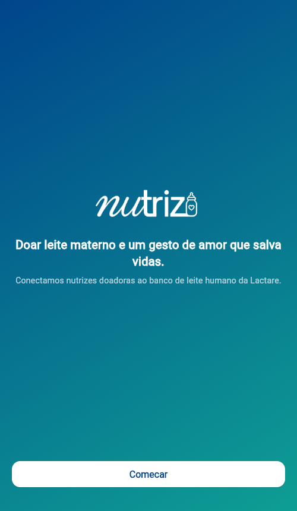

### 2. Landing page

Página pública: hero "Doar Amor. / Multiplica Vidas.", faixa de métricas
(4.200+ doadoras, 12 mil L, 98%), "Três passos para salvar uma vida", pontos de
coleta, bloco da EVA, artigos, depoimentos e rodapé.

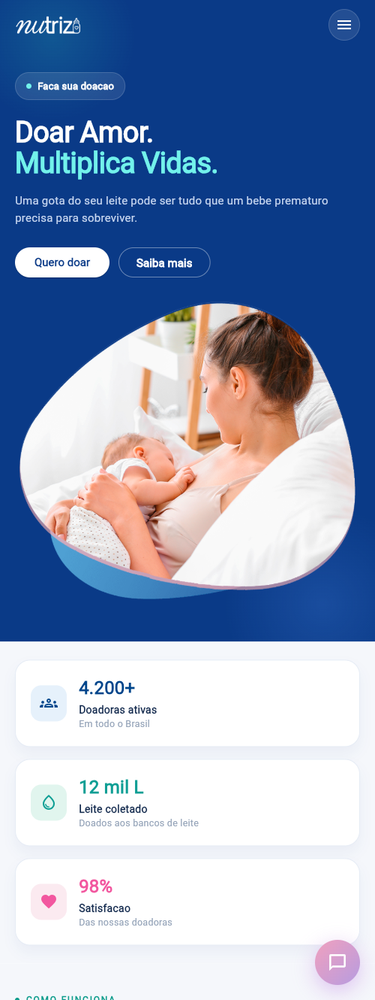

### 3. Login

Card centralizado com validação de e-mail e senha, mostrar/ocultar senha e o
seletor de perfil (Doadora, Admin, Enfermagem) que define a área aberta.

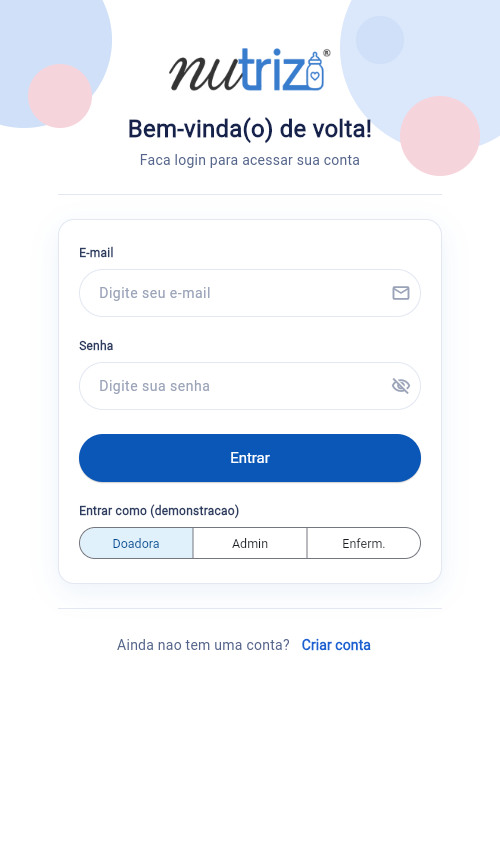

### 4. Cadastro

Assistente de quatro etapas — Dados pessoais, Endereço, Senha e Bebê/termos —
com indicador de progresso e rodapé de navegação.

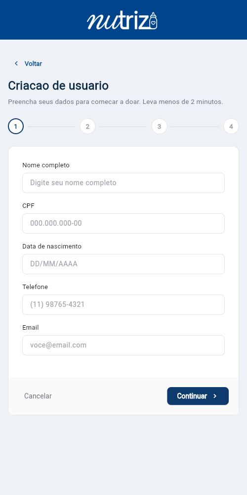

### 5. Início da doadora

Saudação personalizada, botões "Nova Doação" e "Falar com a EVA", cartão da
próxima etapa com progresso, painel "Seu Impacto" (doações, leite doado, bebês
alimentados), acompanhamento da doação e rede de apoio. No canto, o botão
flutuante da EVA.

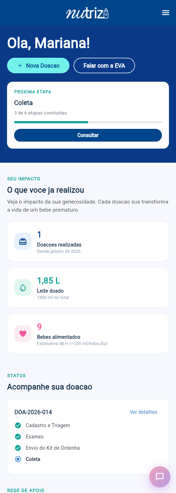

### 6. Minhas doações

Lista das doações com identificador, status, data de início, etapa atual e
barra de progresso. Tocar num card abre o detalhe daquela doação.

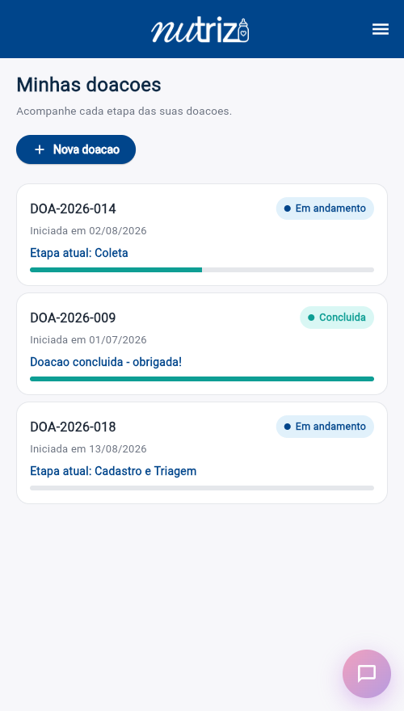

### 7. Pontos de coleta

Bancos de leite e postos com endereço, distância, situação (aberto/fechado) e
indicação de coleta domiciliar.

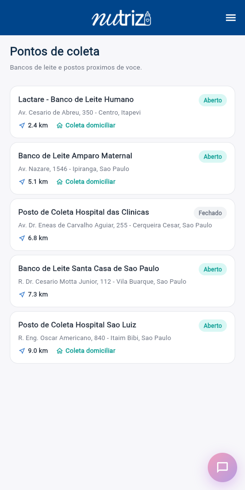

### 8. Conteúdo educativo

Artigo em destaque com capa e a grade com os demais, cada um com categoria,
resumo e tempo de leitura. Tocar num card abre aquele artigo.

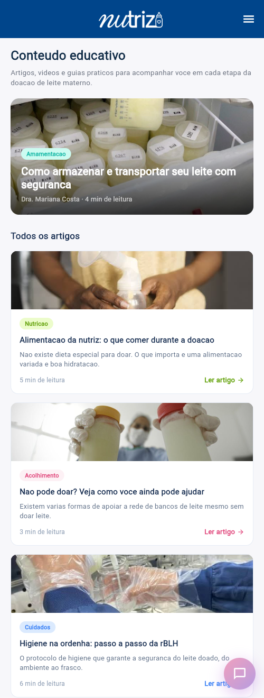

### 9. Perfil

Identificação do usuário e as abas "Meus dados" e "Meu bebê", com os campos
editáveis e a barra de ações que aparece quando há alterações.

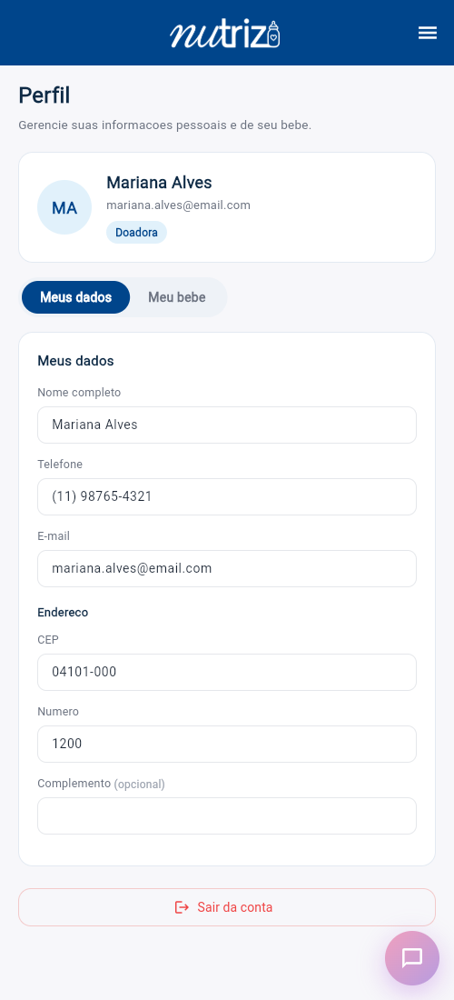

### 10. Painel da administração

Indicadores consolidados: filtro de período, litros captados por mês em barras,
doações ativas por etapa, nível de satisfação, taxa de recorrência, tempo médio
de resposta e doações com erro.

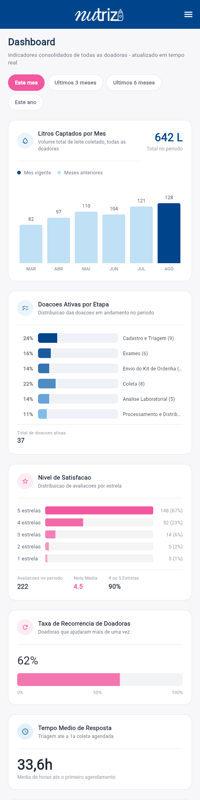

### 11. Agendamentos (enfermagem)

Agendamentos atribuídos, com abas de status (Em Andamento, Concluído, Com Erro)
e cards com doadora, data, local e etapa da doação.

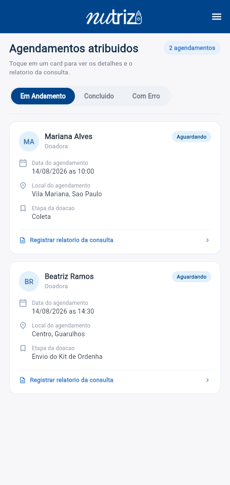

---

## Como executar

Pré-requisito: **Flutter instalado** (canal stable) e um **emulador Android** (ou
dispositivo com depuração USB).

```bash
# 1) Baixar as dependencias
flutter pub get

# 2) Conferir que nao ha erros
flutter analyze

# 3) Rodar a suite de testes
flutter test

# 4) Rodar no emulador/dispositivo Android
flutter run
```

Para revisar rapidamente no navegador (o app tambem roda na web):

```bash
flutter run -d chrome
```

> Se as pastas de plataforma nao existirem no seu clone, gere-as com
> `flutter create --project-name nutriz_app --platforms=android,web .` — o
> comando cria apenas as pastas de plataforma e **não** sobrescreve `lib/`,
> `pubspec.yaml` nem este README.

### Testes

`flutter test` cobre o que costuma quebrar sem aparecer no `analyze`:

- a landing monta sem estouro de layout em celular, tablet e desktop;
- a wordmark aparece no header e não encosta na navegação nem no menu;
- os chips da EVA mantêm a largura do texto e dividem a linha.

---

## Estrutura do projeto

```
assets/
├── images/                   # wordmark, logo colorida, hero, banco de leite
└── artigos/                  # capas dos artigos (as mesmas do site)

lib/
├── main.dart                 # ponto de entrada
├── app.dart                  # MaterialApp, tema e rotas
├── core/
│   ├── routes.dart           # nomes de rota centralizados
│   ├── date_format.dart      # formatacao de datas (sem dependencia externa)
│   └── theme/                # cores, espacamentos e tema do produto
├── models/                   # Nutriz, Bebe, Endereco, Doacao, EtapaDoacao,
│                             # PontoColeta, Artigo, MensagemEva, Agendamento...
├── data/                     # dados mockados (mock_doacoes, mock_pontos,
│                             # mock_artigos, mock_landing, mock_dashboard, ...)
├── screens/                  # uma pasta por area (splash, landing, login,
│                             # register, home, donations, points, content,
│                             # eva, profile, adm, nurse)
│   └── landing/components/   # secoes da landing, uma por arquivo
└── widgets/                  # componentes reutilizaveis
```

Componentes que padronizam o app:

| Widget | Papel |
|---|---|
| `AppHeader` | Barra navy com a wordmark e o botão de menu |
| `AppDrawer` | Menu lateral, com itens conforme o perfil |
| `AppPage` | Casca das telas empilhadas: barra + conteúdo centralizado |
| `ContentContainer` | Coluna centralizada com respiro lateral (o `max-w` do site) |
| `PageTitle` | Título e descrição no corpo da página |
| `EvaFab` / `mostrarEvaWidget` | Botão flutuante e painel da EVA |
| `FilterChips` / `SearchBarNutriz` / `DashboardCard` | Filtros, busca e cards do painel |

- **Flutter puro**, Material Design, sem pacotes de terceiros.
- Gerenciamento de estado simples (`setState`).
- Dados mockados em `lib/data/`, nunca embutidos nas telas.

---

## Observação

App para fins acadêmicos (Sprint FIAP). Todo conteúdo de saúde é informativo e
conservador; a EVA é mockada e não substitui avaliação médica.
